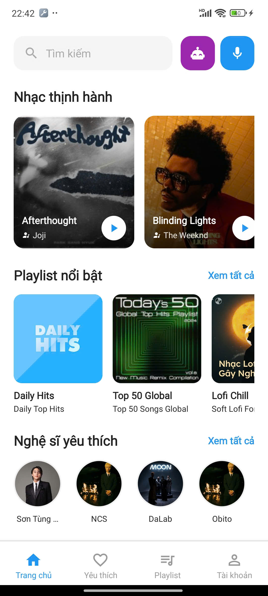
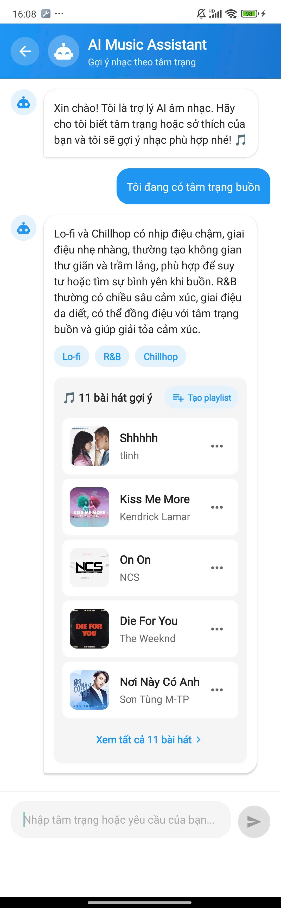

# DiamondMusic 🎵

A React Native music streaming application featuring **background audio playback, AI-assisted music recommendations, Vietnamese lyrics search, playlists, favourites, and artist discovery**.

DiamondMusic consists of a React Native mobile application and a separate Node.js / Express backend.


---

## 📱 App Preview

### Home

<p align="center">
  
</p>

The home screen provides access to trending music, featured playlists, favourite artists, popular songs, search, AI Music Assistant, and voice search.

### Music Player

<p align="center">
  
</p>

The player supports queue-based playback, background audio, shuffle, repeat, playback speed, seeking, and playback controls.

### AI Music Assistant

<p align="center">
  
</p>

The AI Music Assistant uses a backend Gemini integration to interpret user requests and recommend songs based on supported music genres.

### Vietnamese Lyrics Search

<p align="center">
  
</p>

Lyrics search supports Vietnamese accent normalization and backend full-text search, allowing users to search lyrics without necessarily entering Vietnamese diacritics.

### Artist Detail

<p align="center">
  
</p>

The artist detail screen displays artist information and songs associated with the selected artist, with direct access to playback.

---

## ✨ Key Features

### 🎧 Music Playback

- Background audio playback using `react-native-track-player`
- Play / pause
- Next / previous
- Seek
- Queue-based playback
- Shuffle
- Repeat
- Playback speed control
- Remote playback controls

### 🏠 Music Discovery

- Trending songs
- Popular songs
- Featured playlists
- Artist discovery
- Song details
- Artist details
- Genre-based music browsing
- Search

### ❤️ Favourites

- Favourite songs
- Favourite artists
- Access favourite content from the main navigation

### 📚 Playlists

- View playlists
- Browse playlist songs
- Play songs from playlists
- Playlist navigation

### 🤖 AI-Assisted Music Recommendations

DiamondMusic integrates **Google Gemini through the backend** to provide AI-assisted music recommendations.

The recommendation flow is:

```text
User request
     ↓
Gemini
     ↓
Genre classification
     ↓
Genre validation
     ↓
PostgreSQL music query
     ↓
Recommended songs
```

The backend validates AI-generated genres against supported genres and provides a fallback when the AI response cannot be parsed or does not contain valid genres.

> **Note:** This is a genre-based AI-assisted recommendation system, not a personalized machine-learning recommender.

### 🔎 Vietnamese Lyrics Search

The application provides lyrics search through the backend using:

- PostgreSQL Full-Text Search
- Vietnamese accent normalization
- Relevance ranking
- GIN indexing
- `ILIKE` fallback search

This allows Vietnamese lyrics to be searched with or without diacritics.

---

## 🧠 State Management

DiamondMusic uses **Redux Toolkit** and **Zustand** for different state responsibilities.

### Redux Toolkit

Used for application-wide state such as:

- Authentication
- Current user
- Favourite songs
- Favourite artists
- Music-related application state

### Zustand

Used for player-specific state such as:

- Current track
- Track queue
- Playback state
- Shuffle mode
- Repeat mode
- Playback speed
- Player controls

This separation keeps frequently changing playback state independent from the broader application state.

```text
                 React Native App
                        │
              ┌─────────┴─────────┐
              │                   │
       Redux Toolkit           Zustand
              │                   │
       Application State       Player State
              │                   │
       ├─ Authentication       ├─ Current Track
       ├─ User Data             ├─ Queue
       ├─ Favourites            ├─ Playback
       └─ Music State           ├─ Shuffle
                                ├─ Repeat
                                └─ Speed
```

---

## 🧭 Navigation

The application uses nested **Stack and Bottom Tab navigation**.

```text
App Navigator
│
├── Authentication
│   └── Login
│
└── Main
    │
    ├── Home Stack
    ├── Favourites
    ├── Playlist Stack
    └── Account Stack
```

The application also provides shared player and artist-related navigation outside the main tab content.

---

## 🔌 Backend Integration

The React Native application communicates with a separate Node.js / Express REST API through a centralized API service layer.

```text
React Native App
       │
       ▼
   API Service
       │
       │ REST API
       ▼
Node.js / Express
       │
 ┌─────┼──────────────┐
 │     │              │
 ▼     ▼              ▼
Auth  Music       Recommendation
 │     │              │
 │     ├─ Songs       └─ Gemini
 │     ├─ Artists
 │     ├─ Albums
 │     ├─ Playlists
 │     └─ Lyrics
 │
 └── JWT
       │
       ▼
  PostgreSQL
```

The backend handles authentication, music data, playlists, favourites, lyrics search, and AI-assisted recommendations.

---

## 🛠️ Tech Stack

| Category | Technologies |
|---|---|
| Mobile | React Native, JavaScript |
| Navigation | React Navigation |
| State Management | Redux Toolkit, Zustand |
| Audio | React Native Track Player |
| Backend | Node.js, Express.js |
| Database | PostgreSQL |
| Authentication | JWT |
| AI | Google Gemini |
| Media | Cloudinary |
| Development | Git, Postman, Android Studio |

---

## 📂 Project Structure

```text
DiamondMusicApp/
├── src/
│   ├── components/
│   ├── navigation/
│   ├── screens/
│   ├── services/
│   ├── store/
│   └── ...
├── assets/
├── android/
├── package.json
└── ...
```

The frontend separates UI, navigation, application state, player state, and API communication into dedicated areas.

---

## 🚀 Getting Started

### Prerequisites

- Node.js
- Java Development Kit
- Android Studio
- Android SDK
- Android emulator or physical Android device
- React Native development environment

### Installation

```bash
git clone <repository-url>

cd DiamondMusicApp

npm install
```

### Configure the API

Configure the backend API address used by the application according to your local development environment.

The DiamondMusic backend must be running for features that require server data.

### Start Metro

```bash
npm start
```

### Run on Android

```bash
npm run android
```

---

## 🔗 Backend

The mobile application uses a separate backend repository:

**DiamondMusic_BE**

The backend provides REST APIs for:

- Authentication
- Songs
- Artists
- Albums
- Playlists
- Favourites
- Lyrics search
- AI-assisted recommendations

---

## 🎯 Technical Highlights

- Developed a React Native music streaming application with nested Stack and Bottom Tab navigation.
- Implemented background audio playback and remote playback controls using `react-native-track-player`.
- Separated application-wide state with **Redux Toolkit** from player-specific state with **Zustand**.
- Implemented Vietnamese lyrics search using **PostgreSQL Full-Text Search, accent normalization, relevance ranking, and GIN indexing**.
- Integrated an **AI-assisted music recommendation flow** using Gemini through the backend.
- Built a centralized API service layer for communication with the Node.js / Express backend.
- Implemented JWT-based authentication and authentication state restoration.

---

## 📌 Project Status

DiamondMusic was developed as a team project and is maintained as a portfolio project.

The project demonstrates the implementation of a complete mobile music application and its supporting backend. Some production-level concerns such as security hardening, deployment configuration, and automated test coverage would require further work before production use.